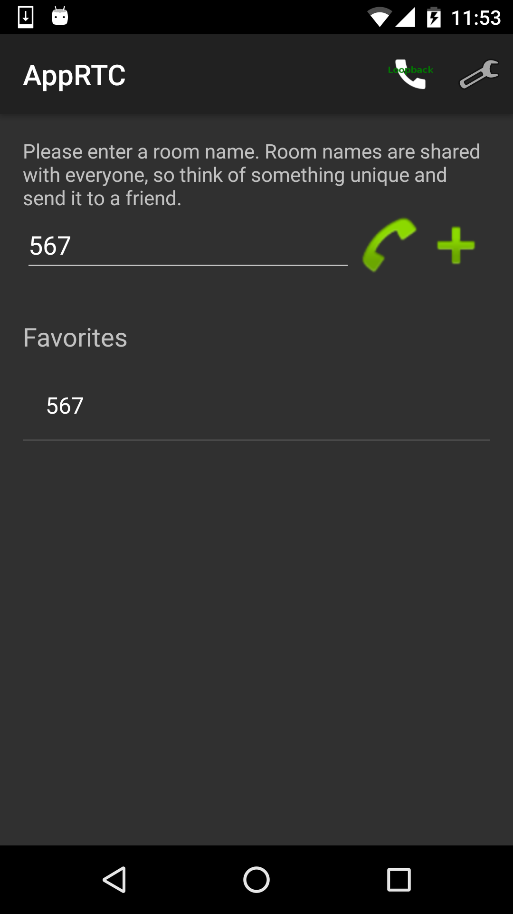
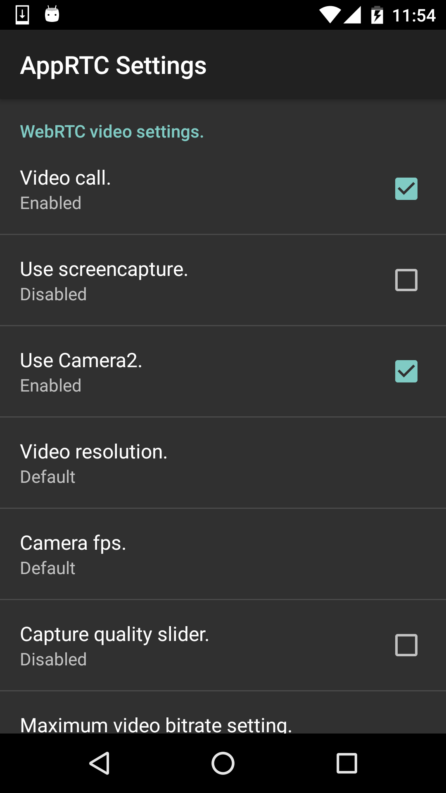

# WebRTC-Android-AppRTC
This android code from android Chromium git and run at https://appr.tc/

## Android Client

### libjinglepeerconnection
- 

### Screen shots

<img src="screenshots/3.png" width="200px" 

